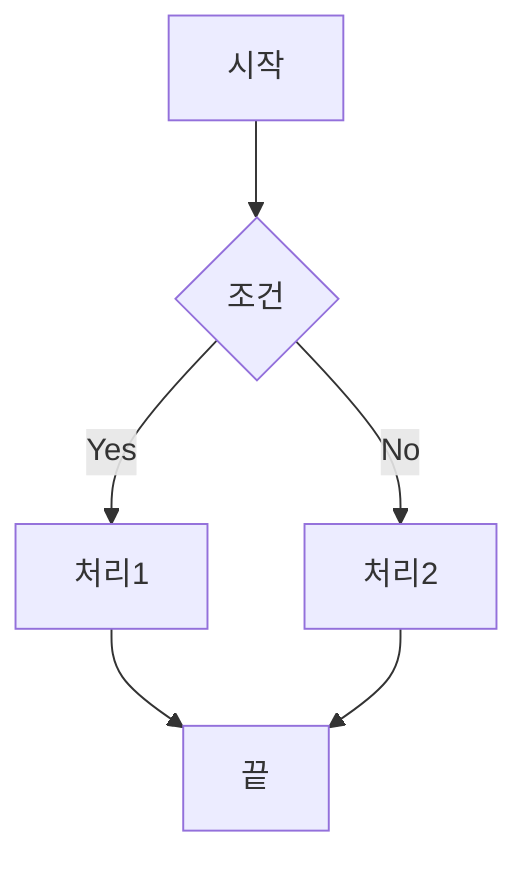
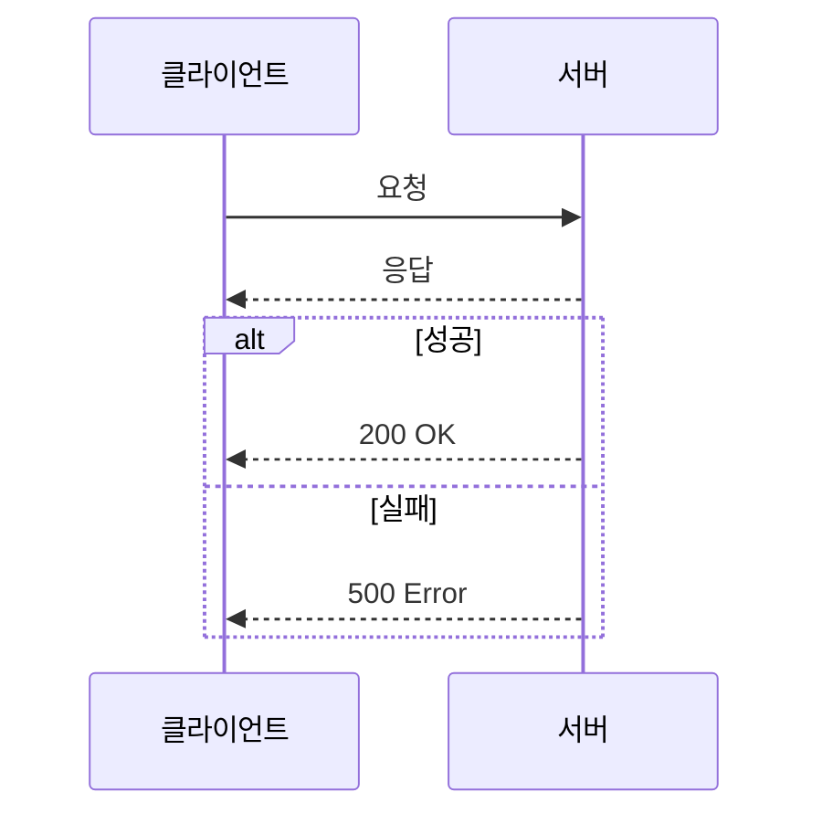
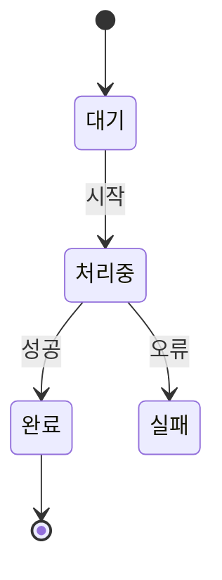
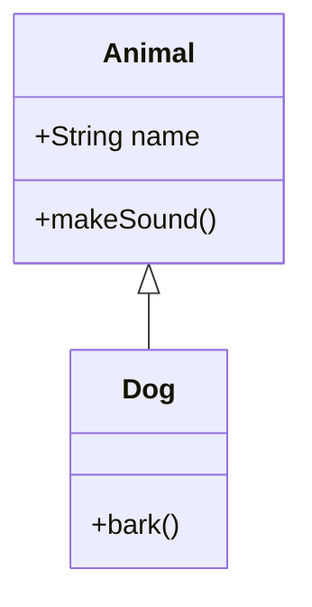
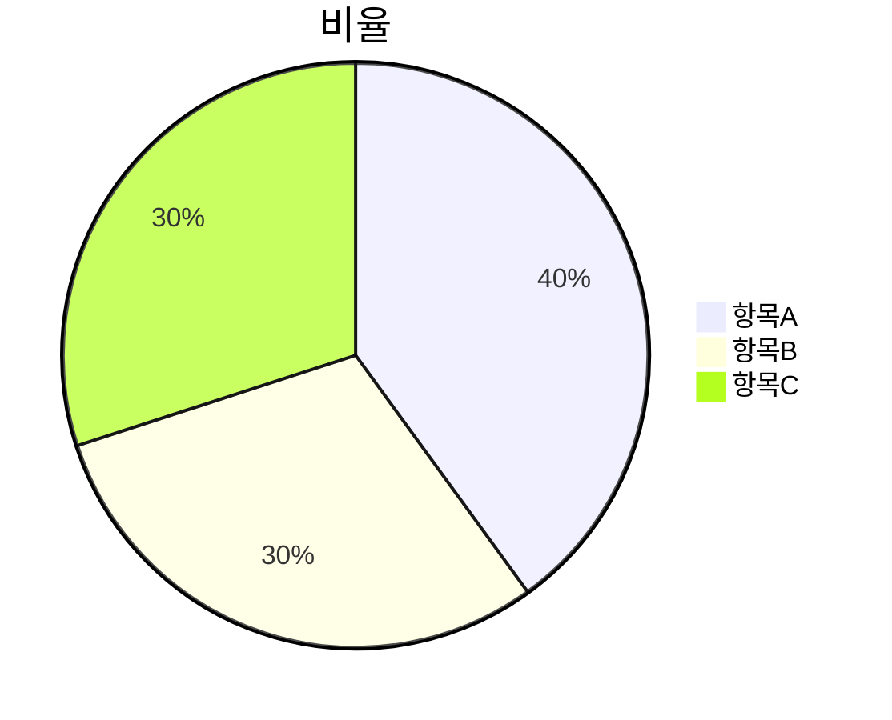
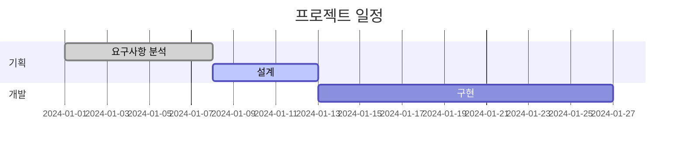
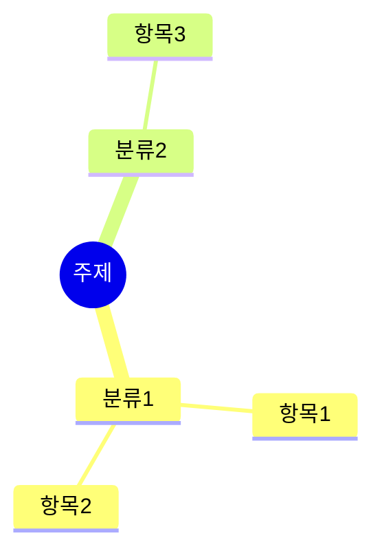

# Blog Post Writing Guide

블로그 포스트 작성 시 사용할 수 있는 마크다운 문법과 특수 기능 가이드입니다.

## 메타데이터 (YAML Front Matter)

포스트 상단에 YAML 형식으로 메타데이터를 작성합니다:

```yaml
---
title: "포스트 제목"
description: "SEO와 미리보기에 사용될 설명 (1-2문장)"
tags: ["태그1", "태그2", "태그3"]
category: "카테고리명"
series: "시리즈명"           # 선택사항
seriesOrder: 1              # 시리즈 내 순서 (선택사항)
---
```

---

## 기본 마크다운

### 제목

```markdown
# H1 제목
## H2 제목
### H3 제목
#### H4 제목
```

### 텍스트 스타일

```markdown
**굵은 텍스트**
*기울임 텍스트*
~~취소선~~
`인라인 코드`
```

### 목록

```markdown
- 순서 없는 목록
- 항목 2
  - 중첩 항목

1. 순서 있는 목록
2. 항목 2
   1. 중첩 항목
```

### 링크와 이미지

```markdown
[링크 텍스트](https://example.com)

```

### 인용문

```markdown
> 인용문 내용
> 여러 줄 가능
```

### 표

```markdown
| 헤더1 | 헤더2 | 헤더3 |
|-------|-------|-------|
| 셀1   | 셀2   | 셀3   |
| 셀4   | 셀5   | 셀6   |
```

### 구분선

```markdown
---
```

---

## 코드 블록

### 일반 코드 블록

````markdown
```javascript
const hello = "world";
console.log(hello);
```
````

지원 언어: `javascript`, `typescript`, `python`, `java`, `go`, `rust`, `bash`, `sql`, `json`, `yaml`, `markdown`, `html`, `css` 등

---

## 수식 (KaTeX)

### 인라인 수식

```markdown
문장 안에 $E = mc^2$ 수식을 넣을 수 있습니다.
```

### 블록 수식

```markdown
$$
\frac{-b \pm \sqrt{b^2 - 4ac}}{2a}
$$
```

### 자주 사용하는 수식 예시

```markdown
- 분수: $\frac{a}{b}$
- 제곱근: $\sqrt{x}$, $\sqrt[n]{x}$
- 지수: $x^2$, $e^{i\pi}$
- 아래첨자: $x_i$, $a_{n+1}$
- 시그마: $\sum_{i=1}^{n} x_i$
- 적분: $\int_{a}^{b} f(x) dx$
- 행렬: $\begin{pmatrix} a & b \\ c & d \end{pmatrix}$
- 그리스 문자: $\alpha$, $\beta$, $\gamma$, $\theta$, $\pi$
```

---

## 다이어그램 (Mermaid)

코드 블록 언어를 `mermaid`로 지정하면 다이어그램이 렌더링됩니다.

### 플로우차트

````markdown

````

**방향:** `TD`(위→아래), `LR`(왼→오), `BT`(아래→위), `RL`(오→왼)

**노드 모양:**
| 문법 | 모양 | 용도 |
|------|------|------|
| `[텍스트]` | 사각형 | 일반 프로세스 |
| `(텍스트)` | 둥근 사각형 | 일반 단계 |
| `([텍스트])` | 스타디움 | 시작/종료 |
| `{텍스트}` | 다이아몬드 | 조건 분기 |
| `[(텍스트)]` | 실린더 | 데이터베이스 |
| `((텍스트))` | 원형 | 연결점 |

**연결선:**
| 문법 | 설명 |
|------|------|
| `-->` | 화살표 실선 |
| `---` | 실선 |
| `-.->` | 화살표 점선 |
| `==>` | 굵은 화살표 |
| `-->\|텍스트\|` | 텍스트 포함 |

### 시퀀스 다이어그램

````markdown

````

**메시지 타입:**
| 문법 | 설명 |
|------|------|
| `->>` | 실선 화살표 |
| `-->>` | 점선 화살표 |
| `-x` | X 표시 (실패) |
| `-)` | 열린 화살표 (비동기) |

**제어 구조:** `alt/else/end`, `opt/end`, `loop/end`, `par/and/end`

### 상태 다이어그램

````markdown

````

### 클래스 다이어그램

````markdown

````

**관계:** `<|--`(상속), `*--`(컴포지션), `o--`(집합), `-->`(연관), `..>`(의존)

### 파이 차트

````markdown

````

### 간트 차트

````markdown

````

**상태:** `done`(완료), `active`(진행중), `crit`(중요)

### 마인드맵

````markdown

````

---

## 특수 컴포넌트

### 퀴즈 (단일)

객관식:
```
❔{"question":"질문 내용?", "options":["선택지1","선택지2","선택지3","선택지4"], "answer":2, "explanation":"해설 내용"}❔
```
- `answer`는 1-based 인덱스 (2 = 두 번째 선택지가 정답)

주관식:
```
❔{"question":"질문 내용?", "answer":"정답 텍스트", "explanation":"해설 내용"}❔
```

### 퀴즈 목록 (복수)

```
❔[
  {"question":"질문1?", "options":["A","B","C","D"], "answer":1, "explanation":"해설1"},
  {"question":"질문2?", "answer":"정답", "explanation":"해설2"}
]❔
```

### 광고 위치

```
🅰️
```

---

## 이미지 캡션 태그

이미지 아래 캡션에 크기/위치 태그를 추가할 수 있습니다:

**형식:** `[{크기}{위치}] 캡션 텍스트`

**크기:**
- `s` - 작게 (1/3)
- `m` - 중간 (1/2)
- `l` - 크게 (전체)

**위치:**
- `l` - 왼쪽 정렬
- `c` - 가운데 정렬 (기본값)
- `r` - 오른쪽 정렬

**예시:**
- `[mc] 이미지 설명` - 중간 크기, 가운데
- `[sl] 작은 이미지` - 작은 크기, 왼쪽
- `[l] 전체 너비` - 크게, 가운데

---

## 작성 팁

1. **제목 계층**: H1은 포스트 제목으로 자동 생성되므로, 본문은 H2(##)부터 시작
2. **코드 블록**: 언어를 명시하면 구문 강조가 적용됨
3. **수식**: 복잡한 수식은 블록 수식(`$$`)으로, 간단한 건 인라인(`$`)으로
4. **다이어그램**: Mermaid Live Editor(https://mermaid.live)에서 미리 테스트 권장
5. **퀴즈**: JSON 형식 주의 - 쌍따옴표 사용, 마지막 항목 뒤 쉼표 없음
6. **미리보기**: `/blog/preview` 페이지에서 실시간 확인 가능

---

## 참고 자료

- [KaTeX 지원 함수](https://katex.org/docs/supported.html)
- [Mermaid 공식 문서](https://mermaid.js.org/)
- [GitHub Flavored Markdown](https://github.github.com/gfm/)
